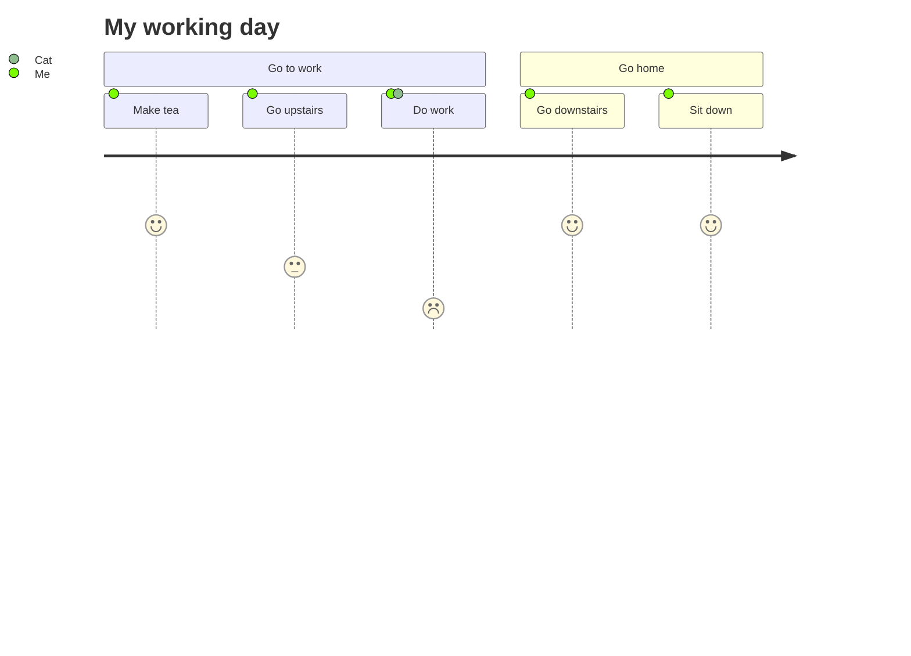
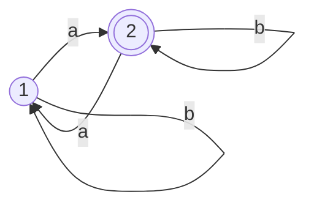

| Syntax      | Description |
| ----------- | ----------- |
| Header      | Title       |
| Paragraph   | Text        |

@mermaid @ pain @code

```java
public class Document{
    private int document;
    Document(int document){
        this.document=document;
    };
}
```







```reponses
+ C'est la bonne réponse
une autre réponse
```
